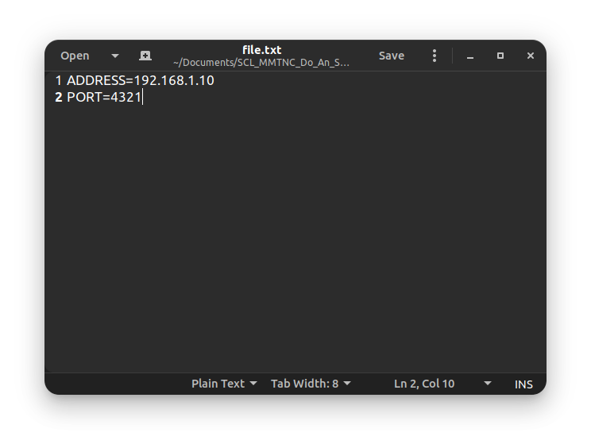
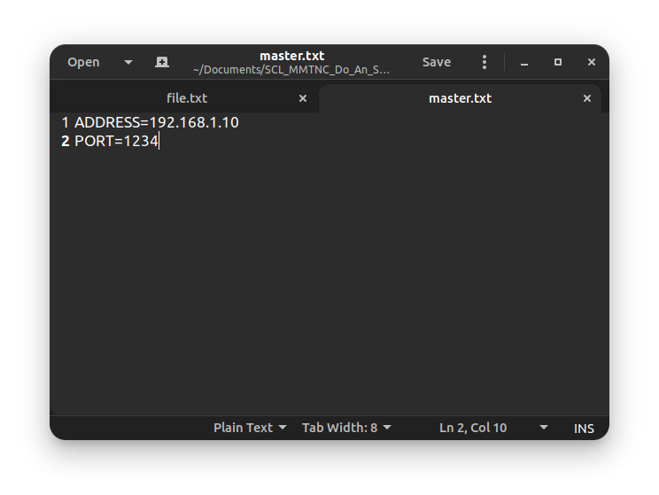

# ĐỒ ÁN MẠNG MÁY TÍNH LẬP TRÌNH SOCKET
_(mã nguồn chính của dự án được lưu trữ tại [https://github.com/cuongpiger/SCL_MMTNC_Do_An_Socket](https://github.com/cuongpiger/SCL_MMTNC_Do_An_Socket))_

## 1. Đề bài
*  [Xem tại đây](DeBaiDASocket.pdf)
## 2. Môi trường
* Hệ điều hành: Ubuntu 20.04 LTS _(các phiên bản khác chưa thử nghiệm)_, Window 10 _(ở mọi phiên bản)_
* Ngôn ngữ: Java 11 LTS
* IDE: khuyến thích IntelliJ

## 3. Tổ chức và cấu hình:
* Thư mục chính của dự án là `project`, dưới đây là cây thư mục:
  

  trong đó:
    * `src`: chứa toàn bộ mã nguồn và tài nguyên chính của dự án.
    * `config`: chứa hai file cấu hình sẽ tìm hiểu sau.
    * `downloads`: nếu chạy ở vai trò `Client` thì mọi tài liệu tải về sẽ nằm trong thư mục này.
    * `modules`: chứa các `class` và các hàm tiện ích của dự án.
    * `resources`: chứa toàn bộ các file mà `Client` có thể tải được thông qua giao thức UDP với `FileServer`.
    * `ClientApp.java`: chạy dưới vai trò là `Client`.
    * `MasterServerApp.java`: chạy dưới vai trò là `MasterServer`.
    * `FileServer`: chạy dưới vai trò là `FileServer`.
    * `src/config/file.txt`: cấu hình IPv4 address và PORT cho `FileServer`, nếu muốn chạy ở IPv4 khác, PORT khác có thể mở file này lên để tùy chỉnh, dưới đây là nội dung file:
      
      ở đây `FileServer` đang chạy tại IPV4 address là **192.168.1.10** và PORT là **4321**.
    * `src/config/master.txt`: tương tự như `file.txt`, đây là file dùng để cấu hình IPv4 address và PORT cho `MasterServer`:
      

## 4. Chạy chương trình:
  * Xem tại đây [https://youtu.be/LNnFf8ZPfjY](https://youtu.be/LNnFf8ZPfjY)
## 5. Tài liệu kham thảo:
* Sách **[An Introduction to Network Programming with Java](https://www.springer.com/gp/book/9781447152538)**
* Mã nguồn tham khảo được demo từ chính đầu sách trên: _[https://github.com/cuongpiger/An_Introduction_to_Network_Programming_with_Java](https://github.com/cuongpiger/An_Introduction_to_Network_Programming_with_Java)_
* Lập trình file transfer qua UDP: _[https://viettuts.vn/lap-trinh-mang-voi-java/udp-transfer-file-example](https://viettuts.vn/lap-trinh-mang-voi-java/udp-transfer-file-example)_
